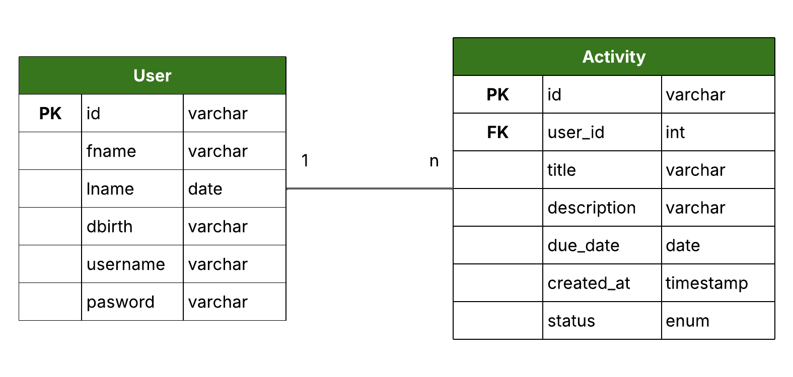

# **Gestor de Atividades Web**

Este projeto consiste no desenvolvimento de um sistema de gestão de atividades, semelhante a um TODO App, para a disciplina de **Programação Web**, lecionada pelo prof. **Luis Felipe Feres**, no curso de **Análise e Desenvolvimento de Sistemas**, da **Faculdade de Tecnologia de Taubaté**.

---

## **1. Fluxo de Desenvolvimento do Projeto**

- Levantamento de Requisitos (com base nas instruções fornecidas pelo professor)
- Modelagem de Dados
- Criação da API (back-end)
- Criação das páginas (front-end)
- Integração da API com as páginas (AJAX)

## **2. Levantamento de Requisitos**

| ID  | Descrição                                                                                                                                 | Tipo |
|-----|-------------------------------------------------------------------------------------------------------------------------------------------|------|
| 1   | O sistema deve permitir que um usuário se cadastre informando seu nome, sobrenome, data de nascimento, nome de usuário e senha.          | F    |
| 2   | O sistema deve permitir que um usuário faça login com seu nome de usuário e senha.                                                       | F    |
| 3   | O sistema deve permitir que um usuário faça logout de sua conta.                                                                         | F    |
| 4   | O sistema deve permitir que um usuário crie uma atividade, informando título, descrição e data de conclusão.                             | F    |
| 5   | O sistema deve registrar automaticamente a data de criação de uma atividade.                                                             | F   |
| 6   | O sistema deve definir o status inicial de uma atividade como "Em aberto".                                                               | F    |
| 7   | O sistema deve permitir que um usuário edite os dados de uma atividade.                                                                  | F    |
| 8   | O sistema deve permitir que um usuário altere o status de uma atividade para "Concluída".                                                | F    |
| 9   | O sistema deve permitir que apenas usuários autenticados acessem e editem seus próprios dados.                                           | F   |
| 10  | O sistema deve garantir que as atividades só possam ser acessadas por seus respectivos autores.                                          | F    |

---

## 3. **Modelagem de Dados**

### **3.1. Usuário**
- Nome
- Sobrenome
- Data de Nascimento
- Nome de Usuário
- Senha

### **3.2. Atividade**
- Título
- Descrição
- Autor
- Data de Conclusão (definida pelo usuário)
- Data de Criação (gerada automaticamente)
- Status ("Pendente" / "Concluída")

### **3.3. Diagrama Entidade-Relacionamento**



### **3.4. Script do banco de dados**

```sql
CREATE TABLE users (
  id INT AUTO_INCREMENT PRIMARY KEY,
  fname VARCHAR(100),
  lname VARCHAR(100),
  dbirth DATE,
  username VARCHAR(50) UNIQUE,
  password VARCHAR(255)
);

CREATE TABLE activities (
    id INT AUTO_INCREMENT PRIMARY KEY,
    user_id INT NOT NULL,
    title VARCHAR(255) NOT NULL,
    description TEXT NOT NULL,
    due_date DATE NOT NULL,
    created_at TIMESTAMP DEFAULT CURRENT_TIMESTAMP,
    status ENUM('pending', 'done') DEFAULT 'pending',
    FOREIGN KEY (user_id) REFERENCES users(id) ON DELETE CASCADE
);
```

---

## **4. Arquitetura de Software**

### **4.1. Ferramentas Utilizadas**

- **Backend:** PHP puro (sem frameworks)
- **Frontend:** HTML, CSS e JavaScript 
- **Banco de Dados:** MySQL (via XAMPP)
- **Comunicação:** Requisições AJAX utilizando o formato **JSON**

### **4.2. Estrutura de Pastas**

```
gestor-atividades-web/
│── backend/            # Lógica do back-end (API, autenticação, includes)
|   │── activities/     # Manipulação de atividades (CRUD)
|   │── auth/           # Autenticação de usuários (login, logout, cadastro)
|   │── includes/       # Arquivos auxiliares (ex: sessão)
│── db/                 # Configurações do banco de dados, DER, dump
│── frontend/           # Front-end
|   │── assets/         # Recursos adicionais
|   |   │── css/        # Arquivos CSS
|   |   │── images/     # Imagens
|   |   │── js/         # Scripts JavaScript
|   │── pages/          # Páginas HTML
│── index.php           # Ponto de entrada da aplicação
│── README.md           # Descrição do projeto
```